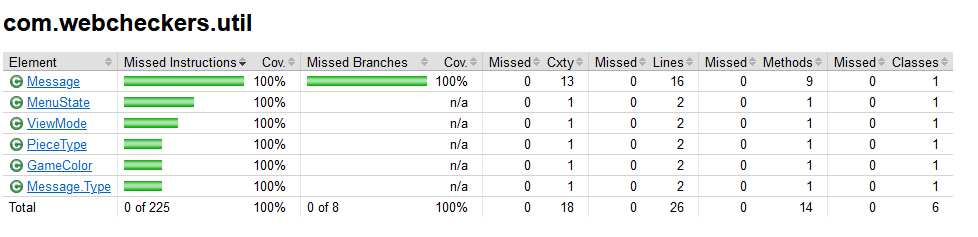

# PROJECT Design Documentation

## Team Information
* Team name: Error 404
* Team members
  * Griffin Danner-Doran
  * Joseph Casale
  * Benjamin LaGreca
  * Evan Wologodzew

## Executive Summary

Our WebCheckers application allows a user to play checkers against other signed-in opponents. There are several custom
themes that players can select to make their WebCheckers experience just that much more enjoyable, as well as a player help 
menu to help them refresh the rules of checkers or learn to play for the first time.

### Purpose
The purpose of this project is to provide an application in which users can log in and challenge other
logged-in users to games of american checkers. The bulk of the application deals with the
login and move validation of players, as well as the internal logistics required to display the correct
view and information.

### Glossary and Acronyms

| Term | Definition |
|------|------------|
| VO | Value Object |
| MVP | Minimum Viable Product |

## Requirements

This section describes the features of the application.

### Definition of MVP
The MVP for this project is an application that allows for 2 or more users to sign in to the application
and then be able to play a fully functioning game of checkers that adheres to the american rule set.
This means that the product should evaluate the legality of moves, and eventually, decide a winner. Along
with these functions, a user should be able to sign out their reserved name and resign from a match
when they want to.

### MVP Features
The main epic used to complete the MVP was the "Play a game" Epic, which contained stories relating to
making legal moves, kinging pieces, winning, and resigning, all MVP features of the game. The "player-sign in"
story covered signing in and signing out, while the "start a game" user story dealt with
challenging other opponents and actually starting the game itself.

### Roadmap of Enhancements
For our first enhancement, we added a theme selection menu. From the home screen, the user can
click a button to go to the theme selection page, where they will see the name of each theme along with an image of what
the board will look like using that theme. Upon selecting a theme, the user will be taken back to the home menu and their
theme will be applied upon starting a game. In Sprint 3, we added the ability to change the theme in game, so users can
change their theme whenever they desire.

For our second enhancement, we implemented a player help menu. This menu is available to open in both the game and home views.
Clicking the help button will take the user to a page with rules, tips, and visuals to help them understand how 
to win a game of checkers. The user will be able to leave the menu when they want, which will take them back to the game
view and update the board to reflect any moves made while in menu if they are in a game, and back to the home menu if not.

When in game, if the user is in either menu when it is their turn, the opponent will see that they are in said menu and 
receive continuous notifications until they exit the menu. Additionally, if a player in the home screen is in a menu,
they cannot be challenged until they leave the menu.

## Application Domain

 
The domain of this application primarily relates to the user interface and the game board. The
user logs in to reserve their own name, which is used as a unique identifier when generating a game. Each game has its
own set of pieces, each of which is placed on the 64 tiles that make up a board.
The player is tied to each of their 12 pieces by their color, which is used to determine
board appearance and turn order. Each user is also tied to their selected theme, which will modify the board also tied
to that player. The player help menu is adjacent to other functions, as it can be opened and closed at any time by a 
player without affecting any other component. 

## Architecture and Design

Our application consists of three tiers, being the model, ui, application and util tiers. Our game model is located in the model tier,
which holds classes for players, moves, pieces, positions, rows, spaces, BoardView, and our move verifier. Our UI tier
contains routes for a home page, signin page, theme selection page, and the help page as well as several pages for in 
game play and post game. Our application tier is quite minimal, consisting only of the default application.java file as 
well as the PlayerLobby class which does most of the heavy lifting for player attribute handling and storage.

### Summary

The following Tiers/Layers model shows a high-level view of the webapp's architecture.

 
As a web application, the user interacts with the system using a
browser.  The client-side of the UI is composed of HTML pages with
some minimal CSS for styling the page.  There is also some JavaScript
that has been provided to the team by the architect.

The server-side tiers include the UI Tier that is composed of UI Controllers and Views.
Controllers are built using the Spark framework and View are built using the FreeMarker framework.  The Application and Model tiers are built using plain-old Java objects (POJOs).

Details of the components within these tiers are supplied below.

### Overview of User Interface

 
This section describes the web interface flow; this is how the user views and interacts
with the WebCheckers application.

Upon opening the application, a new user will see a screen prompting them to log in and a button
taking them to the log in screen. The log in screen displayed by that button contains
a textbox for the user to enter their name, which will be rejected if it contains
any non-alphanumeric characters or is already in use. Once a valid name is given
the user will be returned to home screen with a new button that allows them to sign out.
Signing out will unreserve the name and the player will be taken to the home screen as if they were
a new player. When logged in, the player will see a list of other players names that is hidden 
when not logged in, as well as the total number of players, which is always visible.
Upon entering another players name into the challenge box and then selecting the challenge
button, the player will begin a game as the red side with that player and be taken to the
game view if that player is not in a game, or will be given an error if that player is in game 
or does not exist, as well is if that player is in a menu. When that opposing player's home screen next refreshes, they will be
taken into the game as the white side, and will see the board with their pieces at the bottom
as they would a real checkerboard. Either player can resign at any time, at which point both players will
be returned to the home screen with a corresponding message. As turns occur, the game view will refresh periodically
and inform the user if it is their turn, updating their view to reflect the opponents move. This continues until
a player resigns or one has no valid moves or pieces remaining, at which point each player will be returned to the home
view with a corresponding message.

At any time, a user may choose to open the theme or help menu. If they are in game, the opponent will see a message 
displaying which menu this user is in. Selecting a theme will apply the theme to the game board and take the user back to
the view the menu was opened in, while exiting the help menu will return the user to their original view without any changes.

### UI Tier

 
The above UML depicts the UI tier. Each route is created by the WebServer.Java class, which creates all the routes and
ties them to their respective URLs, which tell the browser what to open.

Upon accessing the web application, users are greeted with a home screen welcoming them to the site
and giving them options to sign in, select themes, challenge an opponent, go to the help menu, and see a list of players. 
A player count is also located toward the bottom of the page. The first action a user must take is to sign
in to the checkers service. When signing in, users select a temporary username that is unique to that
player until signing out. After a user has assigned themselves a username, they will be returned to the home screen
where they can now view a list of possible opponents. At this point, the player can either challenge a player
if one is active, or access the theme picker which is located next to the sign-in button. They can also open the player
help menu, however this action does not modify stored data unlike many of the other routes. Each route depicted above
corresponds to one of these actions, for example getThemeRoute takes you to the theme picker page while PostThemeRoute handles
the selection you made and sends you back to the home view. The most important routes to the game itself are PostGameRoute,
GetGameRoute, and PostCheckTurnRoute. PostGameRoute starts game when a challenge is made by a user, while GetGameRoute
updates the game view based on the users' moves and PostCheckTurnRoute makes sure a player has 1 turn at a time before
switching the active user to the opponent.

 
The above sequence diagram depicts the most important sequence of operations that happens in our project. The PostGameRoute
implementation is what allows the user to enter a game, and is the core mechanic around which our game revolves. When a 
challenge is made, the calling player and their opponent are obtained by the route. In the case that the opponent is in 
a game or menu, or does not exist/is the calling player, the player is returned to the menu with a corresponding error message.
Otherwise, a new game is created with the 2 players and the calling player is sent to the game view as the red player. 
The opponent will be sent to the game view as the white player on the first refresh of their home page. 

 

The above sequence diagram depicts the second most important sequence of operations in our project. The GetGameRoute
implementation described above is what triggers the winning and losing conditions of the game as well as allowing
players to see the moves their opponents have made. The route gets the current player and gets the game from the playerlobby.
If the game is null, this player is returned to the home view with a win because an opponent's actions ended the game in
some way, whether by resigning or losing. This player's board is obtained and updated, and if the board now has no available
moves, this player is returned to the home view with a loss and the game ends. Otherwise, the player is given a notification
corresponding to the opponent's menu state and then their new board is rendered by reflecting and executing the made moves.

The theme selection menu contains 5 themes: Basic, which is the default view, Wattson, which is one we made for fun,
and Versus, which pits RIT vs. MIT with their own respective checkers pieces. In sprint 3, a chad theme was added,
as well as a theme in appreciation of Terry Davis.

Also added in sprint 3, the user can open a player help menu at any time. This menu informs the user of the basic rules
of checkers, and also provides some images to allow a user to better understand how moves and jumps work in checkers.

 
This diagram illustrates the different menu states that came with the implementation of the theme and help menu enhancements.
A player must be notified if their opponent is in a menu and they cannot challenge a player who is in a menu, so it is very
important to these features that the current menu state of any given player is carefully tracked and managed. 

### Application Tier

 

The application tier is much more contained and less visible to the user than the UI tier. It contains only the
application.java class which makes the application, and the PlayerLobby class, which is the core class relating to
player data. The PlayerLobby class stores registered players, their names, and the list of players in games, all 
of which are used by various UI routes to adjust the data shown to each player, such as removing their name from the list
of open players to challenge. It also contains the active game board, which is the essential model object used to hold the
information on the current game, including the player for each side and their respective boards. In sprint 3, the 
PlayerLobby was updated to hold the current menu status of each of its players, which is used to ensure that a player
is not challenged while in a menu.

### Model Tier

 
The player class represents the players that control the pieces. A player selects their own unique
username that is used to differentiate each player. The player class also records how many wins that player has
over their checkers career using our webapp. The player class also holds what menu or screen the player is in,
which is used to coordinate interactions between 2 players and allow each to know if the other is in a menu. 
Each game of checkers is represented by a game object, which is tied to the aforementioned PlayerLobby application tier 
class to be used in coordinating games between different players.

In order to adhere to the single responsibility/high cohesion principle, our checkers BoardView class brings together 
classes we have made to represent the game itself, such as Piece, Row, and Space. Each of these is a specific subsection
of the problem domain, and handles 1 specific role in making a part of the game board. The BoardView class takes these 
individual parts to render and populate the default checkers board with pieces representing  both players' game colors, 
being red and white. A game board has 8 Row objects, which each consist of 8 Spaces to make a square 8x8 board. In addition
to being represented by a space, each tile is represented by a position object, which in turn is used to define the start
and end state of a move object. Depending on the status of the spaces at either end of the move, the MoveVerifier
determines if a move is valid or invalid, rejecting invalid moves to maintain adherence to the american rules. These
moves, if submitted by the player, update the current board and allow the opposing player to take a turn.

### Design Improvements

Overall, our design adheres very closely to the Object-Oriented Principles taught in this class, with Single Responsibility/High Cohesion
being our main focus for much of the project. Similarly, we have stuck closely to the information expert principle as well,
with most classes handling the major calculations for their attributes while providing a sufficient number of public methods
to allow the class to fit into the structure of the project. While our adherence to dependency inversion is quite strong in
the UI tier, our model class uses a lot of direct instantiation, which sometimes made it hard to test complex model classes
when improving our code coverage. This could be solved by creating some form of abstraction related to the game object,
which creates and handles a lot of the low level classes used by the other model tier elements.

While we generally tried to keep our classes within the problem domain, some classes like MoveVerifier and Position were
necessary to handle some back end logic that the user does not need to access. Overall, though, we were able to keep
pure fabrication of new classes minimal and targeted. The controller principle was another principle that we were unable
to follow as closely as we would have liked. Many of the UI tier classes are responsible for evaluating the context in 
which they were called, which resulted in the high complexity and cohesion metrics described later on in this documentation.

Our adherence to Single Responsibility/High Cohesion has, however, led to very high cohesion within our model class, 
which comes along with high coupling. As the slightly chaotic UML diagram for the model tier indicates, perhaps the 
coupling is too high to ignore, so in future work on this project we could add more inheritance. While our project 
architecture design did not present an abundance of opportunities for inheritance, there are several points in our code that may be 
improved by creating inherited classes, which could maintain single responsibility while not increasing coupling to the 
extent it currently exists.

Currently, we account only for ideal user interaction, meaning only actions that follow a normal flow of play, such
as letting the game load in its normal time, waiting for the periodic board updates, and so on. However, unusual user behaviors
are not well covered and documented for our project. This includes things like if the user were to refresh the page during 
the game or at random times, scenarios where our game would likely crash.

Finally, our project could be improved to help the usability of the UI. Our project often features abrupt html transitions
which may disturb users of the product. These could be improved in future instances by adding things like load screens 
and exit prompts for all actions, which would make the user feel much more in control of their game view.

Between sprints 2 and 3, we made a lot of design improvements. The main principle improved upon was Single Responsibility,
which is particularly visible looking at the game and game view. Between the 2 sprints, data was focused much more heavily
into the component that dealt with it most highly. For example, the game class now stores the 2 player boards, one
for each color. Before, the separate boards were stored in session attributes, which made it hard to coordinate changes
between the boards when they were needed to reflect moves. Since the game is responsible for holding the relevant objects
and attributes of the game, it falls well within the game's responsibility to store the boards. Another example of these
improvements is in PostCheckTurnRoute and GetGameRoute. Before, CheckTurnRoute handled switching players, updating the
board, checking if the user won, and refreshing the screen, far more responsibility than it should have. In this sprint,
switching players was given to PostSubmitTurn, which sets the games active color when a move is submitted, and updating
the board as well as checking if the game was over was given to getGameRoute. This improved the single responsibility
adherence of check turn, which now only deals with telling the board if it should update, and leaves the actual creation
and maintenance of the game view to the class that renders it, GetGameRoute. Overall, these changes made it much easier
to locate specific functionality in each class, as tasks like switching turns were no longer shared across 2 or 3 classes.

There were also some changes that we decided not to implement. On several occasions, we discussed splitting PlayerLobby
into different subclasses to handle each of the many lists within the PlayerLobby class in order to maintain adherence
to the Single Responsibility/ High Cohesion principle. However, given that each of the lists still served the purpose
of storing and updating player information, we felt that there was not enough of a violation to single responsibility to
be worth the much increased coupling and pure fabrication required to implement such a change. Additionally, the idea
to combine row, space, and position was also discussed. Again, this was decided against for this session of the project
due to the fact that row and space were classes given by the product owner, and while similar, the position class serves
a fundamentally different role than the space class, with row and space serving as value objects and position serving
as a model tier entity with access to those classes, which serves the purpose of reducing coupling by increasing direct
access functions rather than method chains.

### Metric Analysis and Improvement Suggestions

 

Complexity analysis indicates that the PostValidateMove, PostCheckTurnRoute, GetHomeRoute, GetGameRoute, and BoardView classes 
are too complex, as indicated by an out-of-bounds metric in any of the 3 categories. All 5 of these classes have an average 
cyclomatic complexity of above 3, which indicates that the average method from those classes has more than 3 possible conditional 
routes that it can run through. This originates from the fact that each of the problematic classes handles a large number of 
possible scenarios and must create a specific determination of where to go from each combination of possible factors, which each 
have their own conditional paths. However, given that many of these functions are specifically linked to the JS scripts that we 
were given, it is hard to see how we can reduce the conditionals needed to make sure that the correct game information is being 
received for each outcome decided. 

OC max is the maximum number of routes found in any of the method classes, and only GetHomeRoute is problematic in this metric. 
The creator of cyclomatic complexity analysis, Thomas McCabe, said that anything with a cyclomatic complexity of above 10 should 
be broken down into smaller pieces to handle each route. The only class that violates this rule is GetHomeRoute, which has many 
different conditional routes due to the fact that it has to handle menu refreshes, accounting for new players, starting the game 
attributes and putting challenged players into a game. Creating a new class for refresh functionality was rejected due to its 
corresponding increase in coupling and violation of the pure fabrication principle, however the analysis indicates that this would 
be more beneficial than detrimental since it increases the code's modifiability and reduces complexity following this analysis. 
Despite this, we do not believe it to be critical to resolve this particular metric, because offloading the complexity, 
while it may improve the metric, would likely reintroduce bugs into the home route, which is at the heart of many of our most central features.
Additionally, the class is specifically crafted for its given role, so improved modifiability does not produce enough of a benefit to
prioritize this change over other issues revealed by the metric analysis.

The limit for weighted method complexity was set to 25 for this analysis, and only boardview violates this, which makes sense as it 
handles a large variety of move possibilities and must make sure that each piece has a list of every possible move based on its color, 
type and location. It is hard to pinpoint where this complexity could be reduced, as the context checks involved in generating move 
possibilities are essential to the game’s primary function, and moving them to another class would just create another class that is 
too complex while not achieving anything but higher coupling.

PostCheckTurnRoute’s average cyclomatic complexity is likely somewhat inflated due to a single chunk of nested conditionals to control 
the game’s knowledge of the player in the Menu, which serves to prevent bugs in the game. The class is not overly complex, but it’s 
entire control-flow of what to return is broken into chunks of conditionals. To reduce the average cyclomatic complexity, a separate 
method could be used to check and update the state of the menu.

 

Javadoc coverage for methods and classes is very good, with nearly 100% method coverage in all the classes except for enum classes and 
space.java, where a simple method was missed when adding javadocs. However, there is almost no field coverage. This means that the actual 
attributes of each class are not covered with javadocs. While some single line comments were used to explain/describe important fields 
within some of the more complex classes, no javadocs for field attributes were ever written in our code. Likely our field coverage would 
be in the high 20s to low 30s if our single line comments were converted to javadocs, but we still could improve on this by going 
through our code again and adding a javadoc description to each field variable to increase readability and good documentation practices. 

It does not make the code critically illegible, however; many of these attributes are explained in other documentation, such as the 
javadoc for the constructor.

 

Lines of code coverage does not indicate anything wrong with the project. The boardview class is very long due to the complex nature 
of the data it handles, but the average lines of code per class is a moderate 80 lines, which does not really seem to be worth 
addressing. Perhaps in future iterations, a separate class could be created to handle some of the boardviews operations, however, having 
too many lines of code in a class is a minimal problem and should definitely not be prioritized over complexity/cohesion related issues.

 

Using Martin package metrics, we can see that there is absolutely no abstractness in any of the classes, which is consistent with the 
fact that this iteration of the project has no inheritance whatsoever in any of the classes. We can see that the UI class is entirely 
concrete with no inheritance and high instability, which is good and results in its low distance from the main sequence. However, 
the model and application tiers have much lower instability, despite having the same abstractness of 0 as the UI tier. This results 
from the fact that each of the model tier elements are largely related to each other with only a few attributes in each class, while 
nearly every UI element requires 2 or more of the model tier elements to function, greatly decreasing the instability in a way that 
results in their large distance from the main sequence. This is slightly concerning, as to remain balanced in relative to the main 
sequence they should have much higher instabilities, similar to that seen in the UI tier. In future iterations, the model and 
application classes should be balanced to become more concrete and unstable, which will bring them closer to the main sequence. 

Overall, however, we did quite well in this section. Stability should range between 0.0 - 0.3, or 0.7 - 1; which all of our tiers 
adhere to individually. The UI tier and the util tier have both performed spectacularly. The average stability is the reason why we
would benefit from reducing the instability of the Model tier and the Application tier.

Recall the formula for Instability is Ce / (Ce + Ca); therefore:

Reducing the instability of the model tier could be achieved by either reducing the number of outgoing dependencies, or increasing 
the number of incoming dependencies. This is indication that some of the work being done in the model tier may benefit by being extracted 
from inside the model tier. For the application tier, this may be harder to achieve, as the application class was not written
by us, and the PlayerLobby class has few dependencies that it needs to function, but is used in more than half of the route classes, 
which is the cause of its problematic stability. 

 
The Chidamber-Kemerer metrics reinforce the findings of the complexity analysis, as well as revealing some new information. The LCOM, 
which is better if it is 1, shows that methods are highly cohesive and cannot be split into separate classes. PlayerLobby has a LCOM of 1, 
meaning that it can not easily be split into smaller classes without effort, and so, as we had previously decided, it should remain together 
as a single class. However, Game.Java has a high LCOM of 6, meaning that the metric analysis has determined that it should be split up into 
smaller classes. This kind of makes sense, given that it holds a large variety of unrelated attributes and their getters/setters, however, 
given that each attribute is unique to a game and must be updated and handled by that game, there is no real way around it in this project 
implementation. 

The boardview, in addition to having the high weighted method complexity revealed in the complexity metrics analysis, also has a high RFC 
( Response for class), which further indicates that the number of possible calls and complex operations contained within the boardview class 
may be too high. We also see this high RFC in the playerlobby class, which handles multiple different lists and attributes, but the low LCOM 
of 1 indicates that this is likely not a problem in the playerlobby class. The same goes for post submit turn, which has to check a variety 
of parameters and scenarios, but again a low LCOM indicates that the method is in the place it needs to be. 
 
The boardview class is certainly a point of complex logic that may benefit from being offloaded some to other classes, but the metric may 
have been artificially inflated due to the overloaded getJumpsForSpace method. The boardview class is responsible for providing a full set 
of available moves, and this is accomplished with long methods that check the surroundings of each space that contains a piece. 
This logic is in the boardview class itself, and removing it from the class would require extracting information from the board externally, 
would invite further complexity due to the fact that we have two of these boards alive at once. Providing the simple method call for getMoves 
allowed us to reduce the complexity of the moveIsValid method. This is the reason why moveVerifier’s WMC is within acceptable ranges, 
and it’s RFC, while somewhat high, is also not in the red.

## Testing
So far in this project we have done daily testing, which usually consists of logging in and attempting to play a
game of checkers to near completion. This was done to find errors and confirm that no new changes have caused issues 
with previously tested code in ways which slip through the unit testing safety net. While a few errors have popped up 
and been quickly resolved, the vast majority of tests function exactly as expected, which is a testament to the planned
and incremental approach we have taken to building up functionality.

### Acceptance Testing

Every user story in the active backlog has undergone complete unit testing and as of sprint 4, all have fully passed
every one of their acceptance criteria. While none of the MVP features were successfully implemented at the start of Sprint
3, by the start of Sprint 4 every one of the MVP features had been successfully updated to pass all acceptance criteria.
Additionally, the player help menu enhancement was also implemented in that time frame, and it too was able to successfully
pass all of its acceptance criteria by the end of sprint 3.

### Unit Testing and Code Coverage

 
So far, 92% of the overall lines of code have been successfully unit tested. This has allowed us to be confident that our code
will run without major errors under normal conditions, which has allowed us to proceed forward without the worry that
something will break without us noticing it. Our coverage targets have been to try and get every package to 90-95% coverage,
but there have been some issues in that. One issue is that we have been unable to test some built-in functions 
like the application class fully, as some of its functions are beyond the code and deal with the context the 
entire application is run in, and also some of our own static functions, like the attributes class which holds strings. 
The model tier is also very complex to test, so despite our best efforts we have struggled to get it to reach 90-95% coverage.
Attributes is a class we have not "tested", as it is not practical to do so. Its functionality is as a data class. 
There have been no anomalies, as all of our shortcomings with coverage have really resulted from the complexity of the code.
Given more time to improve coverage on this project, we could easily reach our 90-95% code and ensure that all our code
functions as expected under a variety of scenarios. 

